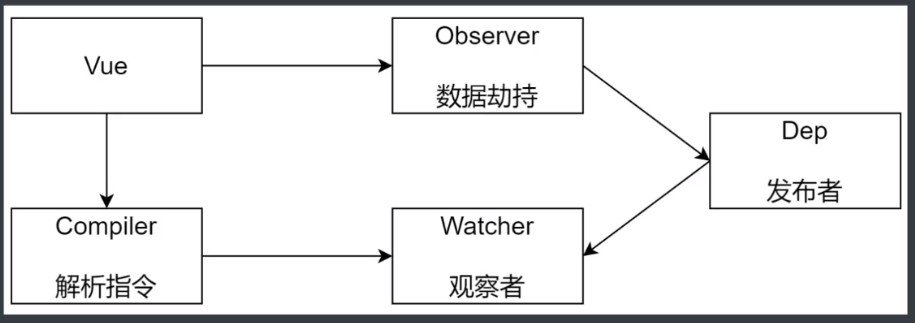

## 一、Vue-Router 原理实现

### Hash 模式和 History 模式的区别
* 表现形式的区别
    * Hash 模式域名后面带有'#'，# 后面的是路由地址，可以通过问号携带参数
    * History 模式就是正常的url地址，需要服务端配置支持
* 原理区别
    * Hash
        * Hash 模式是基于锚点，通过锚点值作为路由地址；以及 onhashchange 事件，地址发生变化是触发onhashchange
        * Hash 模式，调用push方法会先判断当前浏览器是否支持window.pushState，如果支持调用pushState改变地址栏，否则的话通过 window.location 改变地址
    * History
        * 模式是基于 HTML5 中的History API
        * history.pushState()，路径会发生变化，向服务器发送请求，IE10以后才支持
        * history.replaceState() 不会向服务器发送请求，只会改变浏览器地址，并且把地址记录在历史记录
        * history 模式下调用router.push(url) 方法的时候，push 方法内部会调用 window.pushState，把 url 设置到浏览器的地址栏
        * 当历史状态被激活的时候才会触发 popstate 事件

### History 模式
* history 模式需要服务器的支持
* 单页应用中，服务器不存在http://www.xxx.com/login 这样的地址会返回找不到改页面（单页应用只有一个index.html，不存在login页面）
* 在服务端应该除了静态资源外都返回单页引用的index.html

### VueRouter 实现原理
* Hash 模式
    * URL中 # 后面的内容作为路径地址
    * 监听 hashchange 事件
    * 根据当前路由地址找到对应组件重新渲染
* History 模式
    * 通过 history.pushState() 方法改变地址栏
    * 监听 popstate 事件，把访问地址记录在历史，并不会真正跳转路径，也就是浏览器不会发送请求；可以监听到浏览器操作历史的变化，在这个事件处理函数中，可以记录改变后的地址
    * 根据当前路由地址找到对应组件重新渲染

### VueRouter 模拟实现-分析
* Vue.use 方法可以接收一个函数，如果是函数会直接调用这个函数；可以传入对象，传入对象，会调用这个对象的install方法
* 创建一个VueRouter实例， VueRouter 是一个构造函数或者是一个类，这个类有一个静态的install方法
* VueRouter构造函数接收一个对象形式的参数，对象是一些路由规则
* 创建 Vue 实例，传入刚刚定义好的 router 对象


* VueRouter：类名
* options：VueRouter实例传入的路由规则对象
* routeMap：记录路由地址和组件的对应关系，以后把路由规则解析到routeMap
* data：是一个对象，有个current属性，用来记录当前路由地址。设置data是因为需要一个响应式的数据（data是响应式），路由发送变化，对应的组件要更新
* install：是类的静态方法，实现 vue 的插件机制
* constructor：初始化属性，初始化方法
* init：调用后面的方法
* initEvent：注册popstate事件，监听浏览器历史的变化
* createRouteMap：初始化 routeMap 属性，把构造函数中出入的路由规则转换为键值对形式存储到routeMap，routeMap 就是一个对象，键是路由地址，值是对应的组件；在 router-view 组件中会使用 routeMap
* initComponents：创建 router-link 和 router-view 组件

```javascript
Vue.use(VueRouter)

const router = new VueRouter({
  routes: [
    { name: 'home', path: '/', component: homeComponent }
  ]
})

new Vue({
  router,
  render: h => h(App)
}).$mount('#app')
```

### VueRouter-install
* 判断当前插件是否已经被安装
* 把Vue构造函数记录到全局变量
* 把创建Vue实例时候传入的router对象注入到Vue实例上(入口文件中new Vue({})是传入的router)

```javascript
let _Vue = null

export default class VueRouter {
  static install(Vue) {
    // 1、判断当前插件是否已经被安装
    if (VueRouter.install.installed) {
      return
    }
    VueRouter.install.installed = true
    //  2、把Vue构造函数记录到全局变量
    _Vue = Vue
    //  3、把创建Vue实例时候传入的router对象注入到Vue实例上
    // 使用混入，注意this指向，在外面this指向VueRouter，使用混入this指向Vue
    _Vue.mixin({
      beforeCreate() {
        if (this.$options.router) {// vue实例执行；组件不执行，组件的$options不存在router属性
          _Vue.prototype.$router = this.$options.router // 把入口文件中new Vue()是传入的router挂载到$router
        }
      }
    })
  }
}

```

### VueRouter-构造函数


* 构造函数初始化options、routeMap、data
* options：记录构造函数传入的选项（new VueRouter({})中传入的路由规则）
* routeMap：把路由规则解析存储到routeMap，键：路由地址，值：路由组件，将来router-view组件会根据当前路由地址到routeMap对象找到对应的组件渲染到浏览器
* data是一个响应式对象，存储当前的路由地址，路由变化时自动加载组件
* observable：Vue提供的创建响应式对象方法
* current：存储当前的路由地址，判断浏览器地址是否为跟目录，如果是跟目录值为‘/’，如果不是跟目录就为目标地址（/about），如刷新浏览器的情况

```javascript
constructor(options) {
  this.options = options
  this.routeMap = {}
  this.data = _Vue.observable({
    current: window.location.pathname || '/'
  })
}
```

### VueRouter-createRouteMap
把构造函数中传过来的选项的route（路由规则）转为键值对存到routeMap对象

```javascript
createRouteMap() {
  // 遍历所有路由规则，把路由规则解析为键值对形式，存储到routeMap对象
  this.options.routes.forEach(route => {
    this.routeMap[route.path] = route.component
  })
}
```
### initComponents方法创建两个组件 router-link 和 router-view
### VueRouter-router-link
* 点击时阻止 a 标签默认行为（阻止跳转页面）
* 使用history.pushState 把浏览器地址改为 a 标签 href的值
* 把当前路径地址记录在data.current，data是响应式对象，当数据发生变化时会自动更新视图
* Vue的构建版本
    * 运行时版：不支持template模板，需要打包的时候提前编译
    * 完整版：包含运行时和编译器，体积比运行时版大10k左右，程序运行的时候把模板转换成render函数
    * 脚手架安装的vue项目时运行时版本，可通过配置[修改](https://cli.vuejs.org/zh/config/#runtimecompiler)
    * 使用render函数渲染组件

```javascript
initComponents(Vue) { // 传入Vue构造函数是为了减少对外部的依赖
  Vue.component('router-link', {
    props: {
      to: String
    },
    template: '<a :href="to"><slot></slot></a>'
  })
}
```
```javascript
initComponents(Vue) { // 传入Vue构造函数是为了减少对外部的依赖
  Vue.component('router-link', {
    props: {
      to: String
    },
    render(h) {
      // h 函数为我们创建虚拟DOM
      // 参数一：选择器；参数二：DOM元素设置属性；参数三：标签之间的内容，内容有很多所以用数组
      return h('a', {
        attrs: {
          href: this.to
        },
        on: { // 注册点击事件
          click: this.clickHandler
        }
      }, [this.$slots.default]) // 通过this.$slots.default获取默认插槽的内容
    },
    methods: {
      clickHandler(e) {
        e.preventDefault() // 阻止默认行为

        // history.pushState 改变浏览器地址栏地址，不会向服务器发送请求
        // 参数一：data:触发popstate事件时传给popstate事件的事件对象参数；
        // 参数二：title 网页标题；
        // 参数三：地址
        // 改变浏览器地址栏，但不会加载对应的组件
        history.pushState({}, '', this.to)
        // 把当前路径记录在data.current，
        this.$router.data.current = this.to // this.$router.data.current：在install静态方法中已经把$router挂载到Vue上了
      }
    }
  })
}
```

### VueRouter-router-view

```javascript
initComponents(Vue) { // 传入Vue构造函数是为了减少对外部的依赖
  const self = this
  Vue.component('router-view', {
    render(h) {
      // render 函数里的this不是指向Vue实例
      // 获取当前路由地址对应的路由组件，调用 h 函数把组件转为虚拟DOM返回
      const component = self.routeMap[self.data.current] // 获取当前路由对应的组件
      return h(component)
    }
  })
}
```

### VueRouter-initEvent
* 点击浏览器前进、后退要更新界面
```javascript
initEvent() {
  // 浏览器前进 后退
  window.addEventListener('popstate', () => {
    this.data.current = window.location.pathname
  })
}
```

### 手写 Vue Router 完整代码
```javascript
let _Vue = null

export default class VueRouter {
  static install(Vue) {
    // 1、判断当前插件是否已经被安装
    if (VueRouter.install.installed) {
      return
    }
    VueRouter.install.installed = true
    //  2、把Vue构造函数记录到全局变量
    _Vue = Vue
    //  3、把创建Vue实例时候传入的router对象注入到Vue实例上
    // 使用混入，注意this指向，在外面this指向VueRouter，使用混入this指向Vue
    _Vue.mixin({
      beforeCreate() {
        if (this.$options.router) {// vue实例执行；组件不执行，组件的$options不存在router属性
          _Vue.prototype.$router = this.$options.router // 把入口文件中new Vue()是传入的router挂载到$router
          this.$options.router.init() // 入口实例化Vue的时候传入了实例化的VueRouter，此时router挂载到vue的$options属性上
        }
      }
    })
  }

  constructor(options) {
    this.options = options // 记录构造函数传入的选项
    this.routeMap = {} // 把路由规则解析存储到routeMap，键：路由地址，值：路由组件，将来router-view组件会根据当前路由地址到routeMap对象找到对应的组件渲染到浏览器
    // data是一个响应式对象，存储当前的路由地址，路由变化时自动加载组件
    this.data = _Vue.observable({ // vue提供的创建响应式对象方法
    // 存储当前的路由地址，判断浏览器地址是否为跟目录，如果是跟目录值为‘/’，如果不是跟目录就为目标地址（/about），如刷新浏览器的情况
      current: '/'
    })
  }

  init() {
    this.createRouteMap()
    this.initComponents(_Vue)
    this.initEvent()
  }

  createRouteMap() {
    // 遍历所有路由规则，把路由规则解析为键值对形式，存储到routeMap对象
    this.options.routes.forEach(route => {
      this.routeMap[route.path] = route.component
    })
  }

  initComponents(Vue) { // 传入Vue构造函数是为了减少对外部的依赖
    Vue.component('router-link', {
      props: {
        to: String
      },
      render(h) {
        // h 函数为我们创建虚拟DOM
        // 参数一：选择器；参数二：DOM元素设置属性；参数三：标签之间的内容，内容有很多所以用数组
        return h('a', {
          attrs: {
            href: this.to
          },
          on: { // 注册点击事件
            click: this.clickHandler
          }
        }, [this.$slots.default]) // 通过this.$slots.default获取默认插槽的内容
      },
      methods: {
        clickHandler(e) {
          e.preventDefault() // 阻止默认行为

          /**
           * history.pushState 改变浏览器地址栏地址，不会向服务器发送请求
           * 改变浏览器地址栏，但不会加载对应的组件
           * 参数一：data:触发popstate事件时传给popstate事件的事件对象参数；
           * 参数二：title 网页标题；
           * 参数三：地址
           */
          history.pushState({}, '', this.to)

          // 把当前路径记录在data.current，
          this.$router.data.current = this.to // this.$router.data.current：在install静态方法中已经把$router挂载到Vue上了
        }
      }
    })
    const self = this
    Vue.component('router-view', {
      render(h) {
        // render 函数里的this不是指向Vue实例
        // 获取当前路由地址对应的路由组件，调用 h 函数把组件转为虚拟DOM返回
        // 获取当前路由对应的组件，data是响应式的，当当前地址改变后将更新对应的页面
        const component = self.routeMap[self.data.current]
        return h(component)
      }
    })
  }

  initEvent() {
    // 浏览器前进 后退
    window.addEventListener('popstate', () => {
      this.data.current = window.location.pathname
    })
  }
}

```
## 二、模拟 Vue.js 响应式原理

###  数据驱动
* 数据响应式、双向绑定、数据驱动
* 数据响应式
    * 数据模型仅仅是普通的 javascript 对象，而当我们修改数据时，视图会进行更新，避免繁琐的DOM操作，提高开发效率
* 双向绑定
    * 数据改变，视图改变；视图改变，数据也随之改变
    * 可以使用v-model 在表单元素上创建双向数据绑定
* 数据驱动是 Vue 最独特的特性之一
    * 开发过程中仅需要关注数据本身，不需要关心数据是如何渲染到视图

###  数据响应式核心原理-Vue2.x
* [Vue2.x深入响应式原理](https://cn.vuejs.org/v2/guide/reactivity.html)
* [MDN-Object.defineProperty](https://developer.mozilla.org/zh-CN/docs/Web/JavaScript/Reference/Global_Objects/Object/defineProperty)
* 浏览器兼容IE8以上（不兼容IE8）

```html
<div id="app">hello</div>
```

```javascript
// 模拟 Vue 中的 data 选项
let data = {
  msg: 'hello',
  count: 10
}

// 模拟 Vue 的实例
let vm = {}

// 数据劫持：当访问或者设置 vm 中的成员的时候，做一些干预操作
Object.defineProperty(vm, 'msg', {
  // 可枚举（可以遍历）
  enumerable: true,
  // 可配置（可以使用 delete 删除，可以通过 defineProperty 重新定义）
  configurable: true,
  // 当获取值的时候执行
  get () {
    console.log('get', data.msg)
    return data.msg
  },
  // 当设置值的时候执行
  set (newValue) {
    console.log('set', newValue)
    if (newValue === data.msg){
      return
    }
    data.msg = newValue
    // 数据更新，更新 DOM 的值
    document.querySelector('#app').textContent = data.msg
  }
})

vm.msg = 'Hello world'
console.log(vm.msg)
```

多个数据应该递归遍历数据，下面只实现遍历
```javascript
let data = {
  msg: 'hello',
  count: 10
}

let vm = {}

proxyData(data)

function proxyData(data) {
  // 遍历 data 对象中的所有属性
  Object.keys(data).forEach(key => {
    // 把 data 中的属性，转换成 vm 的 setter/getter
    Object.defineProperty(vm, key, {
      enumerable: true,
      configurable: true,
      get () {
        console.log('get', key, data[key])
        return data[key]
      },
      set (newValue) {
        console.log('set', kye, newValue)
        if (newValue === data[key]) {
          return
        }
        // 数据更新，更新 DOM
        document.querySelector('#app').textContent = data[key]
      }
    })
  })
}

vm.msg = 'Hello world'
console.log(vm.msg)
```

###  数据响应式核心原理-Vue3.x
* [MDN-Proxy](https://developer.mozilla.org/zh-CN/docs/Web/JavaScript/Reference/Global_Objects/Proxy)
* 直接监听对象，而非属性
* ES6 中新增，IE不支持，性能由浏览器优化

```html
<div id="app">hello</div>
```

```javascript
// 模拟 vue 中的data
let data = {
  msg: 'hello',
  count: 10
}

// 模拟 vue 实例
let vm = new Proxy(data, {
  // 执行代理行为的函数
  //  当访问 vm 的成员会执行
  get(target, key) { // target：代理的对象；key：访问的属性；这两个参数是系统传递的
    console.log('get, key:', key, target[key])
    return target[key]
  },
  // 当设置 vm 的成员会执行
  set(target, key, newValue) {
    console.log('set, key:', key, newValue)
    if (target[key] === newValue) return
    target[key] = newValue
    document.querySelector('#app').textContent = target[key]
  }
})

vm.msg = 'Hello world'
console.log(vm.msg)
```

### 发布订阅模式
* 发布订阅模式
    * 订阅者
    * 发布者
    * 信号中心
>我们假定，存在一个“信号中心”，某个任务执行完，就向信号中心“发布”(publish)一个信号，其他任务可以向信号中心“订阅”(subscribe)这个信号，从而知道什么时候自己可以开始执行，这就叫做“发布/订阅模式”(publish-subscribe pattern)
* vue 的自定义事件
```javascript
let vm = new Vue()

vm.$on('dataChange', () =>{ console.log('dataChange') })

vm.$on('dataChange', () => { console.log('dataChange1') })

vm.$emit('dataChange')
```
* 自定义事件实现原理
    * 调用 $on 注册事件，调用 $emit 触发事件
    * 在 vm 内部定义变量存储注册的事件名称和事件处理函数
    * 注册事件可以注册多个事件名称，也可以给同一个事件注册多个事件处理函数
    * 所以存储的变量时一个键值对的形式，键是事件名，值是事件处理函数；{ 'click': [fn1, fn2], 'change': [fn1] }
    * $emint传递的是一个事件名称，通过名称去存储的变量找对应的事件处理函数一次执行

* 兄弟组件通信过程
```javascript
// eventBus.js
let eventHus = new Vue()

// componentA.vue
// 发布者
addToDo: function () {
  // 发布消息（事件）
  eventHub.$emit('add-todo', { text: this.newTodoText })
  this.newTodoText = ''
}

// componentB.vue
// 订阅者
create: function () {
  // 订阅消息（事件）
  eventHub.$on('add-todo', this.addTodo)
}

```
* 实现发布订阅模式
```javascript
// 事件触发器
class EventEmitter {
  constructor() {
    this.subs = Object.create(null) // 参数的作用是设置对象的原型，null 该对象没有原型属性
  }

  // 注册事件
  $on(eventType, handler) {
    this.subs[eventType] = this.subs[eventType] || []
    this.subs[eventType].push(handler)
  }

  // 触发事件
  $emit(eventType) {
    if (this.subs[eventType]) {
      this.subs[eventType].forEach(handler => {
        handler() // 调用事件处理函数
      })
    }
  }
}

let em = new EventEmitter()
em.$on('click', () => { console.log('click1') })
em.$on('click', () => { console.log('click2') })
em.$emit('click')
```

### 观察者模式
* 观察者（订阅者）- Watcher
    * update(): 当事件发生时，具体要做的事情
* 目标（发布者）- Dep
    * subs数组: 存储所有的观察者
    * addSun(): 添加观察者
    * notify(): 当事件发生，调用所有观察者的update()方法
* 没有事件中心
    
```javascript

// 发布者
class Dep {
  constructor() {
    // 记录所有的订阅者
    this.subs = []
  }

  // 添加订阅者
  addSun(sub) {
    if (sub && sub.update) {
      this.subs.push(sub)
    }
  }

  // 发布通知
  notify() {
    this.subs.forEach(sub => {
      sub.update()
    })
  }
}

// 订阅者-观察者
class Watcher {
  update() {
    console.log('update')
  }
}

let dep = new Dep()
let watcher = new Watcher()

dep.addSun(watcher)

dep.notify()
```
* 总结
    * 观察者模式是由具体目标调度，比如当事件触发，Dep 就会去调用观察者的方法，所以观察者模式的订阅者与发布者之间存在依赖的
    * 发布/订阅模式由统一调度中心调用，因此发布者和订阅者不需要知道对方的存在


###  模拟Vue响应式原理-分析
需要模拟的vue实例成员有如下5种类型


* Vue
    * 把 data 中的成员注入到 vue 实例，并且把 data 中的成员转成getter/setter
* Observer
    * 能够对数据对象的的所有属性进行监听，如有变动可拿到最新值并通知Dep
* Compiler
    * 解析每个元素指令和差值表达式，并替换成相应的数据
* Dep(观察者模式中的目标)
    * 添加观察者，当数据发生变化，通知所有观察者
* Watcher(观察者模式中的观察者)
    * 内部有一个updater方法，负责更新视图

### 模拟Vue响应式原理-Vue
Vue
* 功能
    * 负责接收初始化的参数（选项）
    * 负责把 data 中的属性注入到 Vue 实例，转换为getter/setter
    * 负责调用 observer 监听 data 中所有属性的变化
    * 负责调用 compiler 解析指令/差值表达式
* 结构


* 实现思路
    * 通过属性保存选项数据
    * 把 data 中的成员转换为 getter 和 setter，注入到 Vue 实例中，方便后续使用
    * 调用 observer 对象，监听数据的变化
    * 调用 compiler 对象，解析指令和差值表达式
```javascript
class Vue {
  constructor(options) {
    // 1.通过属性保存选项数据
    this.$options = options || {}
    this.$data = options.data || {}
    this.$el = typeof options.el === 'string' ? document.querySelector(options.el) : options.el
    // 2.把 data 中的成员转换为 getter 和 setter，注入到 vue 实例中
    this._proxyData(this.$data)
  }

  // 代理数据
  _proxyData(data) {
    // 遍历 data 中的所有属性
    Object.keys(data).forEach(key => {
      // 把 data 中的属性注入到 Vue 实例中
      Object.defineProperty(this, key, {
        enumerable: true,
        configurable: true,
        get() {
          return data[key]
        },
        set(newValue) {
          if (newValue === data[key]) {
            return
          }
          data[key] = newValue
        }
      })
    })
  }
}

```
### 模拟Vue响应式原理-Observer(观察者)
* 功能
    * 负责把 data 选项中的属性转换成响应式数据
    * data 中的某个属性也是对象，把该属性转换成响应式数据
    * 数据变化发送通知，需要结合观察者模式
* 结构


* 实现思路
    * walk 方法判断传入的 data 对象是否是对象；遍历 data 对象的所有属性，调用 defineReactive方法，转化为 getter 和 setter（响应式数据）
    * defineReactive 方法接收三个参数，第三个参数接收的是val，而不是在方法内部通过 data[key]获取值，为什么？
    * 因为访问实例属性时，首先触发 vue.js 里的 get 方法，这个 get 调用了 data[key]即 $data，因为这里调用了_proxyData方法并且把$data传入，这里会触发 observer 里的 get 方法，因为实例化了 Observer 类 并且把 $data 传入；如果在 observer 里直接使用 data[key]，则又触发了这个 get 方法，产生一个死递归，会发生堆栈溢出错误
    * 第三个参数是局部变量，方法执行完应该被释放，但是这里没有释放，原因是传入的 obj 是 data 对象($data)，而 $data 引用了 get 方法，即外部对 get 方法有引用，而 get 方法又用到了val 产生了闭包
    * 当 data 的属性是对象，把这个对象的属性转为响应式数据
    * 当 data 的属性从新赋值为对象的时候，该对象的属性转为响应式数据
    
```javascript
class Observer {
  constructor(data) {
    this.walk(data)
  }

  // 遍历对象的所有属性，判断传入的 data 对象是否是对象，加强代码健壮性
  walk(data) {
    // 1.判断 data 是否是对象
    if (!data || typeof data !== 'object') {
      return
    }
    // 2.遍历 data 对象的所有属性，调用 defineReactive方法，转化为 getter 和 setter（响应式数据）
    Object.keys(data).forEach(key => {
      this.defineReactive(data, key, data[key])
    })
  }

  // 把属性转为getter 和 setter
  // 第三个参数直接把值传入，而不是在内部通过data[key]获取值？
  // 因为访问实例属性时，首先触发 vue.js 里的 get 方法，这个 get 调用了 data[key]即 $data，因为这里调用了_proxyData方法并且把$data传入，
  // 这里会触发 observer 里的 get 方法，因为实例化了 Observer 类 并且把 $data 传入
  // 如果在 observer 里直接使用 data[key]，则又触发了这个 get 方法，产生一个死递归，会发生堆栈溢出错误
  // 使用了闭包，get 方法引用外部变量，所以当 defineReactive 执行完后 val 没有立即释放，所以可以获取值

  defineReactive(obj, key, val) {
    const that = this
    // 如果val是对象，把 val内部的属性转为响应式数据
    this.walk(val)
    Object.defineProperty(obj, key, {
      enumerable: true,
      configurable: true,
      get() {
        return val
      },
      set(newValue) {
        if (newValue === val) {
          return
        }
        val = newValue
        // 判断新值是否是对象类型，如果是就把属性转为响应式
        that.walk(newValue)
        // 发送通知
      }
    })
  }
}

```

### 模拟Vue响应式原理-Compiler
* 功能(操作DOM)
    * 负责编译模板，解析指令/差值表达式
    * 负责页面的首次渲染
    * 当数据变化后重新渲染视图
* 结构

